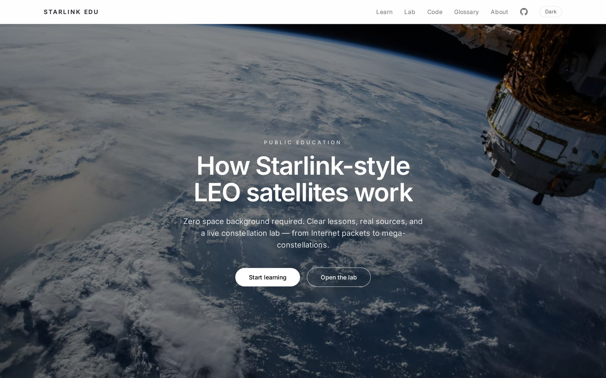
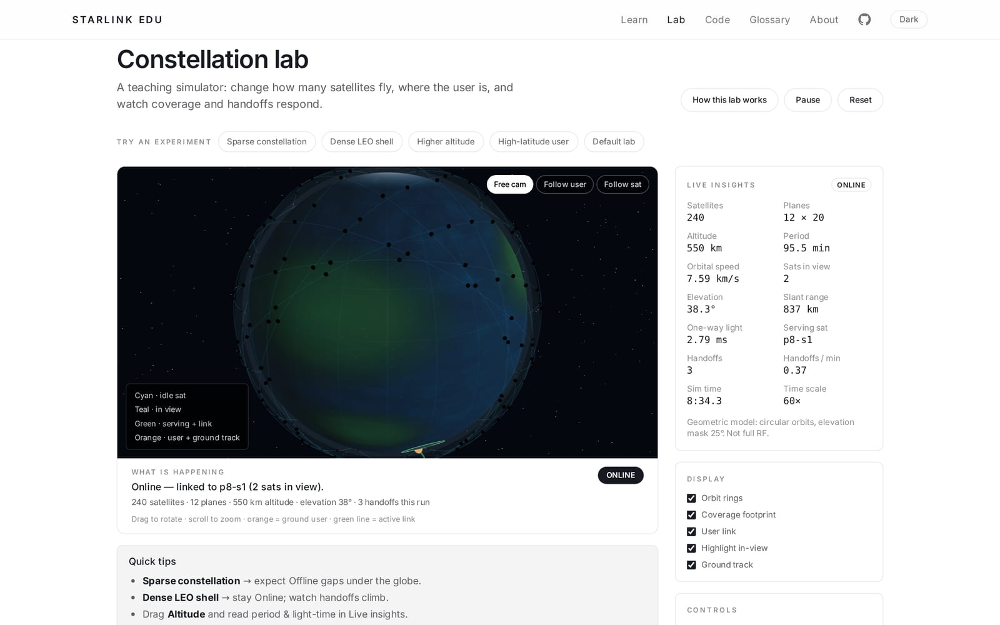
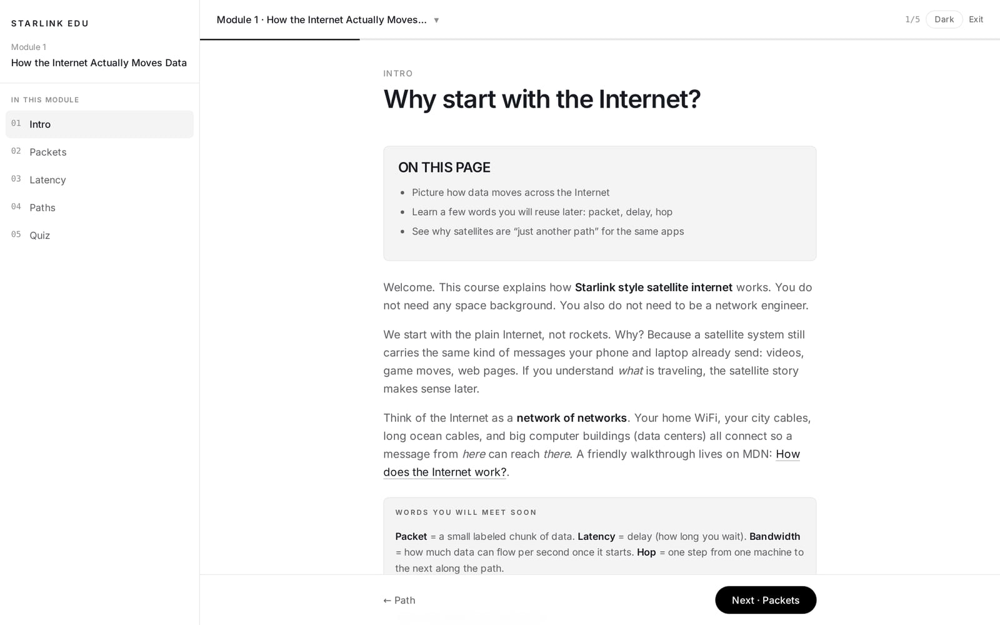

# Starlink Edu

[Live demo](https://starlink-edu.vercel.app/) · [Source](https://github.com/CarloVelarde/starlink-edu)

Public education site for **Starlink-style LEO constellations**: page-by-page lessons, a guided 3D lab, and optional in-browser Python code-alongs.

Not affiliated with SpaceX. Pedagogical models only (circular Kepler, geometric elevation).

<p>
  
</p>
<p>
  
</p>
<p>
  
</p>

## Stack

Vite · React · TypeScript · React Router · React Three Fiber · Tailwind · Vitest  

Static SPA on Vercel — **no backend**. Progress in `localStorage`.

## Highlights

- **Curriculum** — Internet → GEO → LEO → ops → constellation → terminal → network  
- **3D lab** — pure TS orbital/coverage model (`src/sim/`) rendered with R3F; shareable URL state  
- **Code-alongs** — optional Python via Pyodide in the browser  
- **Tests** — unit + BDD on the sim/display contracts (`npm test`)

## Setup

Node 20+.

```bash
npm install
npm run dev      # local
npm test         # unit + bdd
npm run build    # production
```

## License

[MIT](LICENSE)
